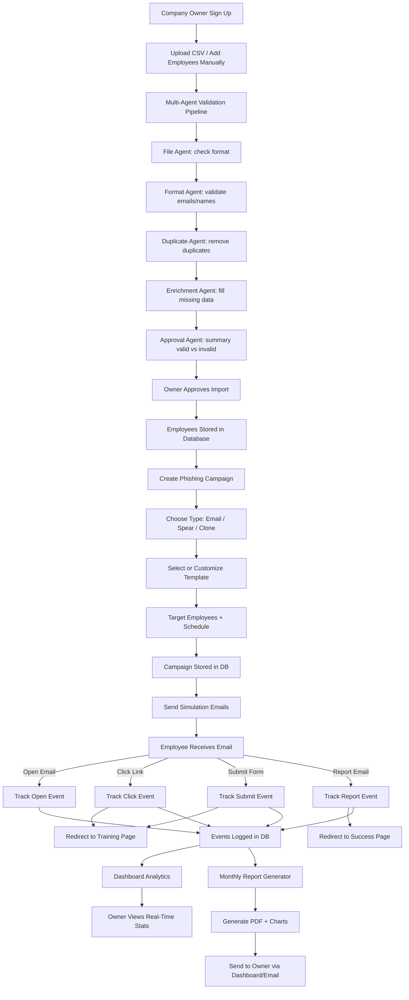

```mermaid
flowchart TD
    A[Company Owner Sign Up] --> B[Upload CSV / Add Employees Manually]
    
    B --> C[Multi-Agent Validation Pipeline]
    C --> C1[File Agent: check format]
    C1 --> C2[Format Agent: validate emails/names]
    C2 --> C3[Duplicate Agent: remove duplicates]
    C3 --> C4[Enrichment Agent: fill missing data]
    C4 --> C5[Approval Agent: summary valid vs invalid]
    
    C5 --> D[Owner Approves Import]
    D --> E[Employees Stored in Database]

    E --> F[Create Phishing Campaign]
    F --> F1[Choose Type: Email / Spear / Clone]
    F1 --> F2[Select or Customize Template]
    F2 --> F3[Target Employees + Schedule]
    F3 --> G[Campaign Stored in DB]

    G --> H[Send Simulation Emails]
    H --> I[Employee Receives Email]

    I -->|Open Email| J1[Track Open Event]
    I -->|Click Link| J2[Track Click Event]
    I -->|Submit Form| J3[Track Submit Event]
    I -->|Report Email| J4[Track Report Event]

    J2 --> K1[Redirect to Training Page]
    J3 --> K1
    J4 --> K2[Redirect to Success Page]

    J1 & J2 & J3 & J4 --> L[Events Logged in DB]

    L --> M[Dashboard Analytics]
    M --> N[Owner Views Real-Time Stats]

    L --> O[Monthly Report Generator]
    O --> P[Generate PDF + Charts]
    P --> Q[Send to Owner via Dashboard/Email]
```