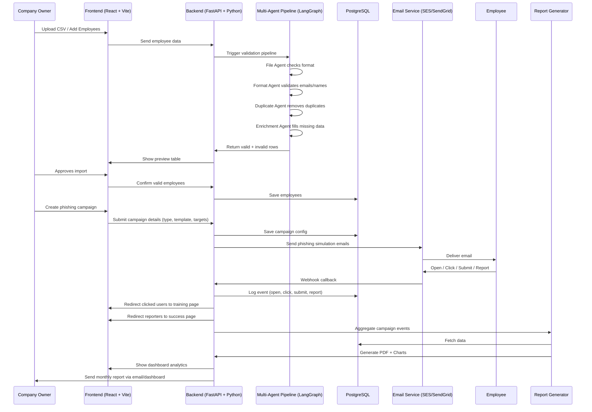

```mermaid
sequenceDiagram
    participant CO as Company Owner
    participant FE as Frontend (React + Vite)
    participant BE as Backend (FastAPI + Python)
    participant AG as Multi-Agent Pipeline (LangGraph)
    participant DB as PostgreSQL
    participant ES as Email Service (SES/SendGrid)
    participant EM as Employee
    participant REP as Report Generator

    %% Employee Data Upload & Validation
    CO->>FE: Upload CSV / Add Employees
    FE->>BE: Send employee data
    BE->>AG: Trigger validation pipeline
    AG->>AG: File Agent checks format
    AG->>AG: Format Agent validates emails/names
    AG->>AG: Duplicate Agent removes duplicates
    AG->>AG: Enrichment Agent fills missing data
    AG->>BE: Return valid + invalid rows
    BE->>FE: Show preview table
    CO->>FE: Approves import
    FE->>BE: Confirm valid employees
    BE->>DB: Save employees

    %% Campaign Creation
    CO->>FE: Create phishing campaign
    FE->>BE: Submit campaign details (type, template, targets)
    BE->>DB: Save campaign config

    %% Email Sending
    BE->>ES: Send phishing simulation emails
    ES->>EM: Deliver email

    %% Employee Interaction
    EM->>ES: Open / Click / Submit / Report
    ES->>BE: Webhook callback
    BE->>DB: Log event (open, click, submit, report)

    %% Training Flow
    BE->>FE: Redirect clicked users to training page
    BE->>FE: Redirect reporters to success page

    %% Reporting
    BE->>REP: Aggregate campaign events
    REP->>DB: Fetch data
    REP->>BE: Generate PDF + Charts
    BE->>FE: Show dashboard analytics
    BE->>CO: Send monthly report via email/dashboard
```